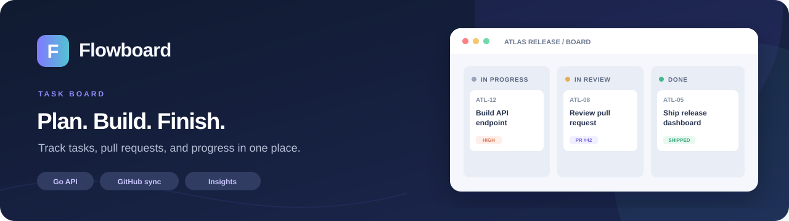
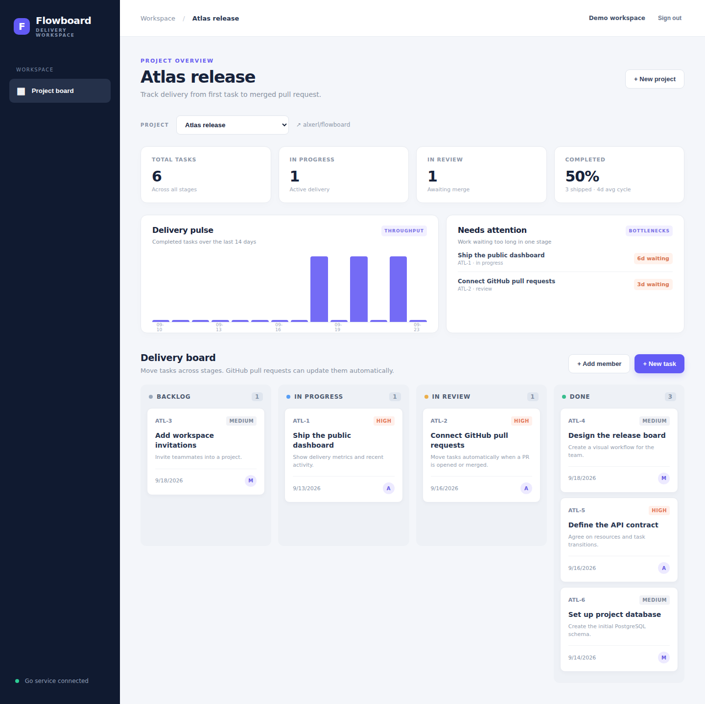
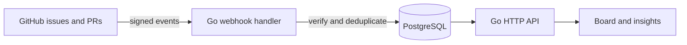

<p align="center">
  
</p>

<p align="center">
  <strong>A delivery workspace for small software teams.</strong><br>
  Turn GitHub issues into tasks, follow pull requests through review, and see where work gets stuck.
</p>

<p align="center">
  <a href="https://github.com/alxerl/flowboard/actions/workflows/ci.yml"></a>
  &nbsp; Go · PostgreSQL · Docker Compose · GitHub webhooks
</p>

## Preview

This screenshot is from the running demo workspace. The repository includes sample data, so the board and analytics are ready as soon as the stack starts.



## Run in one command

With Docker and Docker Compose installed:

```sh
docker compose up --build
```

Open **[localhost:8080](http://localhost:8080)** and click **Explore demo workspace**. No GitHub account, webhook, or API key is needed for the local demo.

The first start creates the database and sample workspace. Press `Ctrl+C` to stop. To delete the local demo data as well, run `docker compose down -v`.

## What Flowboard does

| Area | What is implemented |
|---|---|
| Team workspace | Registration, sessions, project owners and members, private project data |
| Delivery board | Four workflow stages, priorities, assignees, drag-and-drop cards, activity history |
| GitHub sync | Signed issue and pull request webhooks with idempotent delivery processing |
| Automation | Issues become tasks; opening a linked PR moves a task to review; merging it moves the task to done |
| Insights | 14-day throughput, completion rate, average cycle time, and tasks stalled in review or progress |

### From GitHub to the board

1. An issue in a connected repository creates a task. Editing, closing, or reopening the issue updates that task.
2. A PR title or description can refer to a task with its project key and ID, such as `ATL-2`.
3. Opening the PR moves the task to **In review**; merging it moves the task to **Done**. Both actions appear in the activity history.

GitHub events are verified with the webhook secret and deduplicated by delivery ID in PostgreSQL.

## Architecture



The Go service embeds the web interface, exposes the JSON API, and applies database schema changes at startup. Docker Compose starts it alongside PostgreSQL. CI runs unit and integration tests, then starts the full stack from a clean checkout and checks demo login, projects, and insights.

<details>
<summary><strong>Connect a GitHub repository</strong></summary>

The local demo works without this step. To sync your own repository:

1. Create a project and enter its repository as `owner/name`.
2. Set `GITHUB_WEBHOOK_SECRET` in a local `.env` file. See `.env.example`.
3. Add a GitHub webhook with the same secret, JSON content type, and **Issues** and **Pull requests** events. Point it to `https://your-host/webhooks/github`.
4. Include a task reference such as `ATL-2` in a PR title or description.

</details>

<details>
<summary><strong>API routes</strong></summary>

| Method | Path | Purpose |
|---|---|
| POST | `/api/auth/register`, `/api/auth/login`, `/api/auth/logout` | Accounts and sessions |
| GET / POST | `/api/projects` | List or create projects |
| GET / POST | `/api/projects/{id}/members` | List members or add an existing user (owner only) |
| GET / POST | `/api/projects/{id}/tasks` | List or create tasks |
| GET / PATCH / DELETE | `/api/tasks/{id}` | Read, update or delete a task |
| GET | `/api/tasks/{id}/events` | Task activity history |
| GET | `/api/projects/{id}/metrics` | Delivery metrics |
| GET | `/api/projects/{id}/insights` | Throughput and stalled tasks |
| POST | `/webhooks/github` | Signed GitHub events |

The API uses an HTTP-only session cookie. `DEMO_MODE=1` enables a shared demo account; use `DEMO_MODE=0` and your own database credentials for private workspaces.

</details>
