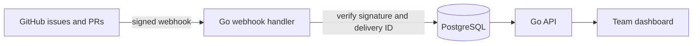

# Flowboard

Flowboard is a Go and PostgreSQL delivery tracker for small software projects. It combines a team task board with GitHub issues and pull request events: issues become tasks, opening a linked PR moves a task into review, and merging it marks the task done. The dashboard shows delivery status, two-week throughput, average cycle time, and work stalled in review or progress.

## How it works



- **Repository sync:** signed issue events create or update tasks. Pull requests containing a task reference such as `ATL-2` move that task to review or done.
- **Idempotent events:** GitHub delivery IDs are stored in PostgreSQL, so retries do not create duplicate tasks or activity entries.
- **Team access:** accounts use password hashes and server-side sessions. Project owners add registered teammates; other projects stay private.
- **Delivery insights:** the dashboard plots completed tasks by day and highlights work that has spent over two days in review or five days in progress.

The product is currently a functional local demo. A hosted instance and email invitations are planned next.

## Run locally

```sh
docker compose up --build
```

Open <http://localhost:8080> and choose **Explore demo workspace**. The demo workspace is created on the first start. Set `DEMO_MODE=0` to disable demo access and start with an empty database. The local Compose stack uses development database credentials; configure your own `DATABASE_URL` for other environments.

To run Go directly, start PostgreSQL and set `DATABASE_URL` as shown in `.env.example`, then run `go run .`.

## GitHub integration

1. Create a project with its repository in `owner/name` form.
2. Set `GITHUB_WEBHOOK_SECRET` to a random secret. For Compose, put it in a local `.env` file.
3. In the GitHub repository, add a webhook pointing to `https://your-host/webhooks/github`, select `application/json`, choose **Issues** and **Pull requests** events, and use the same secret.
4. Include the project key and task ID in a PR title or description, for example `ATL-2 Add dashboard metrics`.

Only signed `issues` and `pull_request` events are processed. Duplicate GitHub delivery IDs are ignored. The webhook works only for projects whose repository matches the event repository. Opening an issue creates a task; editing, closing, or reopening it updates the linked task.

## API

| Method | Path | Purpose |
|---|---|---|
| POST | `/api/auth/register`, `/api/auth/login`, `/api/auth/logout` | Accounts and sessions |
| GET / POST | `/api/projects` | List or create projects |
| GET / POST | `/api/projects/{id}/members` | List members or add an existing user (owner only) |
| GET / POST | `/api/projects/{id}/tasks` | List or create tasks |
| GET / PATCH / DELETE | `/api/tasks/{id}` | Read, update or delete a task |
| GET | `/api/tasks/{id}/events` | Task activity history |
| GET | `/api/projects/{id}/metrics` | Delivery metrics |
| GET | `/api/projects/{id}/insights` | Two-week throughput and stalled tasks |
| POST | `/webhooks/github` | Receive signed GitHub issue and PR events |

Example:

```sh
curl -X POST http://localhost:8080/api/projects/1/tasks \
  -H 'Content-Type: application/json' \
  -d '{"title":"Ship release dashboard","priority":"high","assignee":"Alex"}'
```

The API uses an HTTP-only session cookie. A new project is owned by its creator. Owners can add registered users as members or owners; only project members can access its tasks, events, and metrics. `DEMO_MODE=1` enables a shared demo account, so use `DEMO_MODE=0` for private workspaces.

## Next milestones

- Email invitations and self-service acceptance for project membership.
- Configurable webhook-driven automation rules.
- Advanced filters and customizable bottleneck thresholds.
- Hosted demo and a short walkthrough video.
